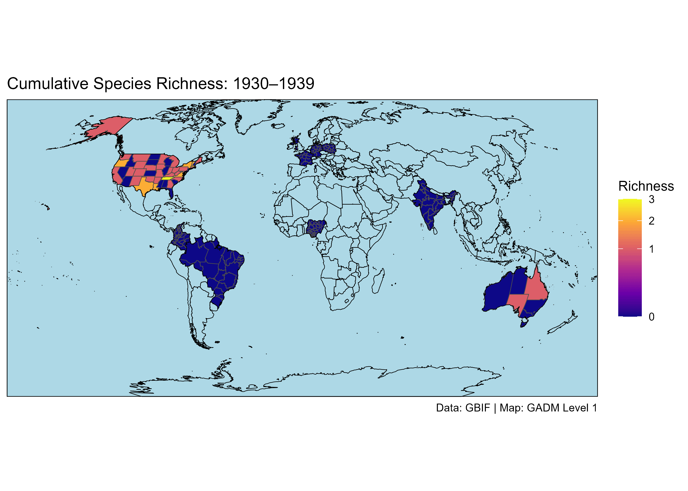

<!-- README.md is generated from README.Rmd. Please edit that file -->

```{r, include = FALSE}
knitr::opts_chunk$set(
  collapse = TRUE,
  comment = "#>",
  fig.path = "man/figures/README-",
  out.width = "100%"
)
```

# biofetchR

<!-- badges: start -->
<!-- badges: end -->

`biofetchR` is an R package designed to streamline the batch import, spatial processing, and standardized export of GBIF occurrence data tailored for large-scale biodiversity, invasion biology, and macroecological research.

## ## 🔑 Key Features of `biofetchR`

- **Automated GBIF Downloads**  
  Authenticated, high-throughput GBIF data retrieval across multiple *species × country* combinations, with built-in retry logic and resilient error handling.

- **Smart Query Optimization**  
  Pre-download occurrence checks minimize redundant queries, ensuring efficient and targeted data extraction.

- **Flexible Spatial Integration**  
  Supports spatial joins with Global Administrative Areas (GADM) at user-specified administrative levels, as well as marine joins using Exclusive Economic Zones (EEZ) for oceanic taxa.

- **Customizable Spatial Thinning**  
  Implements spatial thinning to address sampling bias, with user-defined distance thresholds and optional diagnostic outputs.

- **Temporal Filtering and Aggregation**  
  Enables occurrence filtering across user-defined temporal blocks (e.g., decades), supporting time-series analyses and cumulative richness calculations.

- **Structured Export Outputs**  
  Automatically saves cleaned, standardized `.csv` files for each *species × country* or *species × EEZ* combination—ready for downstream modeling or synthesis.

- **High-Quality Visualization Tools**  
  Provides built-in functions to generate publication-ready static and animated maps of species richness and occurrence using `ggplot2`.

- **Efficient Caching and Modularity**  
  Modular functions support reproducible workflows and enable scalable biodiversity pipelines with smart caching and intermediate result storage.

- **Downstream Compatibility**  
  Designed for seamless integration with trait databases, environmental predictors, and phylogenetic models for ecological, invasion, and biogeographic research.

---

`biofetchR` offers a flexible, scalable foundation for combining spatial, temporal, and taxonomic data in reproducible biodiversity workflows—supporting a wide range of applications, from macroecology to conservation planning.


## Installation

You can install the development version of biofetchR from [GitHub](https://github.com/) with:

``` r
# install.packages("remotes")
remotes::install_github("Dstuart505/biofetchR")
```

## Mapping Terrestrial Species Richness Across Administrative Regions
Understanding terrestrial biodiversity patterns requires organizing occurrence data within consistent geographic boundaries. The Global Administrative Areas (GADM) database provides high-resolution political boundaries across multiple levels—from national borders (Level 0) to subnational units such as states, provinces, or districts (Levels 1 and 2). This package leverages GADM units to spatially aggregate species occurrences and visualize changes in species richness across space and time.

The GADM workflow is flexible in spatial scale: users can specify which administrative level to use when mapping species richness, making it suitable for both global and regional analyses. For example, Level 0 enables country-level comparisons, while Levels 1 or 2 allow finer-scale exploration of biodiversity trends within nations.

## Use Cases
This workflow is designed to support a broad range of applications in biodiversity science and environmental management. It can be used to:

- Detect regional hotspots of species richness or under-sampled areas in need of survey effort.

- Track temporal shifts in biodiversity, such as range expansions or contractions over decades.

- Support biogeographic comparisons across administrative boundaries for conservation planning.

- Quantify patterns of non-native or invasive species richness, informing biosecurity risk assessments and monitoring the geographic footprint of biological invasions.

- Integrate with ecological, climatic, or socio-political datasets that are also structured around GADM
units (e.g., land cover, governance, GDP, policy variables).

This GADM-based mapping framework offers a reproducible and scalable foundation for understanding terrestrial species distributions across multiple disciplines and spatial scales.

```{r example, eval=FALSE}

library(biofetchR)

# --- GBIF User Credentials ---
# Provide your GBIF username, password, and email for authenticated downloads
user <- "your_username"
pwd <- "your_password"
email <- "your_email_address"

# --- Prepare Terrestrial Species × Country Data Frame ---
# Define a tibble with species names and ISO2 country codes for batch processing
test_terrestrial <- tibble::tibble(
  species = c(
    "Rattus norvegicus", "Sus scrofa",                         # mammals
    "Lantana camara", "Imperata cylindrica",                   # plants
    "Harmonia axyridis", "Aedes aegypti",                      # insects
    "Salmo trutta", "Cyprinus carpio", "Eichhornia crassipes", # freshwater species
    "Sturnus vulgaris", "Columba livia",                       # birds
    "Rhinella marina", "Trachemys scripta elegans",            # amphibians and reptiles
    "Cryphonectria parasitica",                                # fungi
    "Batrachochytrium dendrobatidis"                           # amphibian pathogen
  ),
  iso2c = c(
    "US", "AU", "IN", "BR", "DE", "CO",
    "GB", "PL", "NG", "ZA", "FR", "AU",
    "US", "US", "CR"
  )
)

# =============================================================================
# Run GBIF processing pipeline for terrestrial species using GADM Level 1 units
# This step:
#   - Downloads GBIF occurrence data (if needed)
#   - Cleans and optionally thins coordinates
#   - Joins occurrences to GADM Level 1 polygons
#   - Generates summary tables per species × country × admin unit
#   - Returns the full processed dataset if `return_all_results = TRUE`
# =============================================================================

all_data_gadm <- process_gbif_gadm_pipeline(
  df = test_terrestrial,            # Input dataframe: must include 'species' and 'iso2c' columns
  output_dir = output_dir,          # Where to save GBIF downloads and cleaned outputs
  user = user,                      # GBIF user credentials (username)
  pwd = pwd,                        # GBIF password
  email = email,                    # GBIF email (used to receive download notifications)
  apply_thinning = TRUE,            # Apply spatial thinning to reduce sampling bias
  dist_km = 5,                      # Minimum distance (km) between retained occurrence points
  batch_size = 3,                   # Number of species to process per GBIF batch (limits API load)
  return_all_results = TRUE,        # Return full combined GBIF dataset in memory
  export_summary = TRUE,            # Export per-species × country × GADM1 summary tables to CSV
  store_in_memory = TRUE,           # Retain intermediate GBIF downloads and joins in memory
  use_planar = FALSE,               # Use geographic (lon/lat) coordinates, not planar CRS, for thinning
  gadm_unit = 1                     # GADM level for spatial join (0 = country, 1 = admin-1, etc.)
)

# --- Generate Global Species Richness Maps by Time Block ---
# Produces PNG maps and optionally an animated GIF showing temporal richness changes
plot_gadm_richness_by_time(
  data = all_data_gadm,               # Main input dataset: species richness per GADM unit × period
  gadm_cache_dir = "gadm_cache",      # Directory where GADM Level 1 shapefiles are cached
  output_dir = "outputs/",            # Folder to save PNG maps and GIFs
  start_year = 1930,                  # Start year for temporal blocks (inclusive)
  end_year = 2020,                    # End year for temporal blocks (inclusive)
  block_length = 10,                  # Duration of each time block in years (e.g. 10 = decadal)
  include_antarctica = FALSE,         # Exclude Antarctica to avoid empty or misleading polygons
  crs_proj = "+proj=robin",           # Use Robinson projection for visually balanced global maps
  viridis_option = "plasma",          # Color scale for richness gradient (e.g. "viridis", "magma")
  show_graticules = FALSE,            # Disable lat/lon graticule gridlines for cleaner output
  show_plots = TRUE,                  # Show plots in viewer during execution (set FALSE for batch mode)
  animated_gif = TRUE,                # Generate animated GIF across time blocks
  cumulative = TRUE                   # Show cumulative richness (not just new additions per block)
)


```

## Visualizing Temporal Changes in Species Richness

The animated map below illustrates changes in species richness across global administrative regions (GADM Level 1) over decadal time blocks. It highlights spatial and temporal patterns in species accumulation and spread.

This GIF was generated using the plot_global_gadm_richness_by_time() function included in the package.

```{r show-gif, echo=FALSE, out.width="700px", fig.align="center"}

```

## Mapping Marine Species Richness Across EEZs
Marine biodiversity is spatially structured in complex ways, shaped by ocean currents, temperature gradients, and human activity. Unlike terrestrial environments, the ocean lacks clear political or ecological boundaries for organizing biodiversity data. To address this, Exclusive Economic Zones (EEZs)—maritime regions extending up to 200 nautical miles from a nation's coastline—are widely used as standardized units for marine ecological analyses, policy planning, and conservation assessments.

This package enables the aggregation and visualization of marine species occurrence data within EEZ boundaries, allowing users to explore temporal patterns in species richness across global marine regions. Whether studying shifts in species distributions, emerging biodiversity hotspots, or long-term trends in ocean biota, EEZ-based mapping provides a flexible and scalable framework for analysis.

```{r example, eval=FALSE}

# Example marine invasive species list for testing EEZ-based richness mapping
# These species occur exclusively in marine environments, so no ISO2 country code is needed

test_marine <- tibble::tibble(
  species = c(
    "Mytilus galloprovincialis",  # Mediterranean mussel
    "Carcinus maenas",            # European green crab
    "Perna viridis",              # Asian green mussel
    "Crassostrea gigas",          # Pacific oyster
    "Halicarcinus planatus",      # Hairy handed crab
    "Pterois volitans",           # Red lionfish
    "Scomberomorus commerson",    # Narrow-barred Spanish mackerel
    "Lates calcarifer",           # Barramundi
    "Seriola lalandi",            # Yellowtail kingfish
    "Thunnus albacares"           # Yellowfin tuna
  )
)

# Run marine EEZ-only GBIF processing pipeline
# This function handles GBIF download, spatial joining to EEZs, and optional spatial thinning.
# It is customized for marine species by skipping country filters and using EEZ joins only.

all_data_eez <- process_gbif_eez_pipeline(
  species_vec = test_marine$species,  # Vector of marine species names (no country codes needed)
  output_dir = output_dir_marine,     # Directory where outputs (CSV + summary) will be saved
  user = user,                        # GBIF user credentials (username)
  pwd = pwd,                          # GBIF password
  email = email,                      # GBIF email (required for download requests)

  apply_thinning = TRUE,              # Whether to apply spatial thinning (to reduce sampling bias)
  dist_km = 5,                        # Minimum distance (in km) between retained points during thinning
  batch_size = 3,                     # Number of species per GBIF download batch (smaller batches help                                        # avoid API timeouts)    

  return_all_results = TRUE,          # If TRUE, returns all processed data as a list
  export_summary = TRUE,              # If TRUE, saves a CSV summary table 
  store_in_memory = TRUE,             # If TRUE, keeps full processed datasets in R memory 
  use_planar = FALSE                  # Whether to use planar projection for spatial joins
)

# Generate animated global maps of invasive marine species richness over time
# This function aggregates richness by EEZ and time block, then saves maps as PNGs and an animated GIF.

plot_global_eez_richness_by_time(
  data = all_data_eez,                # Cleaned GBIF + EEZ-joined data
  output_dir = output_dir,            # Directory to save PNGs and optional animated GIF
  start_year = 1930,                  # Start year of the time series (inclusive)
  end_year = 2020,                    # End year of the time series (inclusive)
  block_length = 10,                  # Length of each time block in years (e.g., 1930–1939, 1940–1949)

  crs_proj = "+proj=wintri",          # Projection for global map 
  viridis_option = "viridis",         # Viridis color palette used for richness scale 
  show_graticules = FALSE,            # Disable graticule gridlines
  show_plots = TRUE,                  # Display each map interactively as it is generated
  animate = TRUE,                     # Save animated GIF of richness changes over time
  cumulative = FALSE                  # If TRUE, shows cumulative richness per EEZ
)

```

## Visualizing Temporal Changes in Marine Species Richness
The animated map below illustrates changes in invasive marine species richness across global Exclusive Economic Zones (EEZs) over decadal time blocks.

This GIF was generated using the plot_global_eez_richness_by_time() function included in the package. The function automatically joins marine GBIF records to EEZ boundaries, aggregates richness by time period, and produces a series of publication-ready maps and an animated visualization.

```{r show-gif, echo=FALSE, out.width="700px", fig.align="center"}
knitr::include_graphics("inst/figures/richness_map_eez_animated.gif")
```


## License

`biofetchR` is licensed under the [MIT License](https://opensource.org/licenses/MIT).  
See the [`LICENSE`](LICENSE) file for details.

---

## Bug Reports

If you encounter any issues or have feature requests, please report them on the GitHub issue tracker:  

[https://github.com/Dstuart505/biofetchR/issues](https://github.com/Dstuart505/biofetchR/issues)

Before reporting a bug, please ensure you are using the latest version of `biofetchR` and provide a minimal reproducible example if possible.

---

